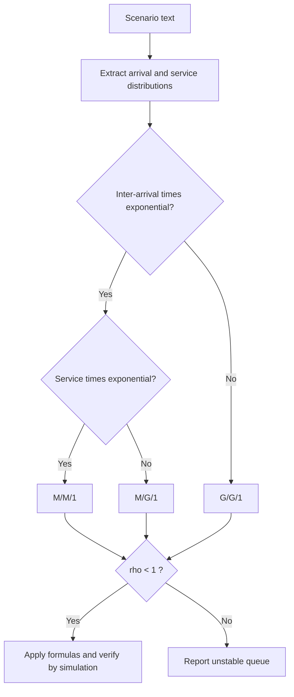
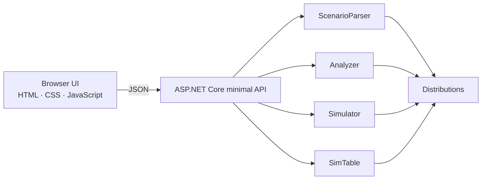

<div align="center">

# Queueing Model Simulation and Performance Analysis System

**Describe a queue in plain English. The system identifies the model, applies the correct theory, and proves the answer by simulation.**


</div>

---

## Overview

Queueing theory answers practical questions: *How long will a customer wait? How busy is the server? How many people are in line?* This project is a complete analysis workbench for the three classical **single-server** models, built as a course project for **Simulation and Modelling** at **UBIT**.

It goes beyond a formula calculator in three ways:

1. **It judges the model for you.** Paste a scenario in plain English; the system extracts the parameters and decides whether it is **M/M/1**, **M/G/1** or **G/G/1**, explaining its reasoning.
2. **It shows its work.** Every result comes with step-by-step calculations, the assumptions that were applied, and a stability check.
3. **It verifies itself.** Each analytic answer is cross-checked against a discrete-event simulation, with confidence intervals.

## Contents

- [Features](#features)
- [Supported models](#supported-models)
- [Quick start](#quick-start)
- [Using the application](#using-the-application)
- [Mathematical foundation](#mathematical-foundation)
- [Architecture](#architecture)
- [API reference](#api-reference)
- [Project structure](#project-structure)
- [Validation](#validation)
- [Assumptions and limitations](#assumptions-and-limitations)
- [Team](#team)
- [License](#license)

## Features

| | |
|---|---|
| **Scenario Analyzer** | Plain-English input → automatic model identification, parameter extraction, and warnings for unsupported features (finite capacity, priorities, balking) |
| **M/M/1 · M/G/1 · G/G/1 calculators** | Dedicated screens with Load Example, Reset and Show Solution |
| **Single-Server Simulation** | Customer-by-customer table: arrival, service start, service end, waiting, system time, idle time, plus summary statistics |
| **Rate-wise / Mean-wise input** | Enter λ and μ, or mean times; conversion is automatic |
| **Unit handling** | Minutes or hours; everything is normalised to minutes internally so units are never mixed |
| **Distributions** | Exponential, Deterministic, Uniform, Normal, Gamma and General (mean + variance) |
| **Stability rule** | ρ < 1 enforced; unstable queues are reported instead of producing meaningless numbers |
| **Input validation** | Non-numeric, zero, negative and inconsistent values are rejected with clear messages |
| **Compare Models** | The same queue under M/M/1, M/G/1 and G/G/1 side by side |
| **Theory & Formulas** | Built-in reference: notation, symbols, assumptions and every equation used |
| **Simulation cross-check** | Long-run simulation with 95 % batch-means confidence interval and convergence chart |

## Supported models

Kendall notation `A / S / c` — **A** arrival distribution, **S** service distribution, **c** number of servers.

| Model | Arrivals | Service | Servers | Result type | Method |
|---|---|---|---|---|---|
| **M/M/1** | Exponential (Poisson) | Exponential | 1 | Exact | Closed-form birth–death results |
| **M/G/1** | Exponential (Poisson) | General | 1 | Exact | Pollaczek–Khinchine formula |
| **G/G/1** | General | General | 1 | Approximation | Kingman's formula with Krämer–Langenbach-Belz correction |

**How the model is chosen**



> Multi-server versions (M/M/c via Erlang C, and an Allen–Cunneen approximation for general inputs) are also supported by the Scenario Analyzer.

## Quick start

**Prerequisites:** [.NET 10 SDK](https://dotnet.microsoft.com/download/dotnet/10.0)

```bash
git clone https://github.com/SyedWaqarAliZaidi/queueing-model-simulation.git
cd queueing-model-simulation
dotnet run
```

Open the address printed in the console (for example `http://localhost:5000`) in any modern browser. Stop the server with `Ctrl + C`.

## Using the application

1. **Scenario Analyzer** — type or pick an example such as:
   > *Customers arrive at a bank according to a Poisson process with rate 10 per hour. Service times are exponentially distributed with mean 4 minutes. There is one teller.*

   The system reports **M/M/1**, explains why, shows theory versus simulation, and lists every calculation step. Any value the parser misreads can be edited and re-run.
2. **M/M/1, M/G/1, G/G/1** — choose *Rate-wise* or *Mean-wise*, enter the parameters, press **Calculate**, then **Show / hide solution** for the working.
3. **Single-Server Simulation** — generate random customers from distributions, or type your own inter-arrival and service times to reproduce a textbook table.
4. **Compare Models** — see how added variability (M/M/1 → M/G/1 → G/G/1) changes waiting time.

**Writing good scenarios:** mention the words *arrive / arrivals*, *service time / takes / processing*, the distribution (Poisson, exponential, uniform, constant, normal, gamma, general) and numbers with units. For general distributions give a standard deviation or variance.

## Mathematical foundation

Symbols: λ arrival rate · μ service rate · ρ utilisation · L, Lq customers in system / queue · W, Wq time in system / queue · Ca², Cs² squared coefficients of variation.

**Conversion and stability**

```
λ = 1 / E[A]        μ = 1 / E[S]        ρ = λ / μ  <  1
```

**M/M/1 (exact)**

```
P0 = 1 − ρ          L  = ρ / (1 − ρ)         Lq = ρ² / (1 − ρ)
W  = 1 / (μ − λ)    Wq = ρ / (μ − λ)         Pn = (1 − ρ) ρⁿ
```

**M/G/1 — Pollaczek–Khinchine (exact)**

```
E[S²] = Var(S) + E[S]²
Wq = λ · E[S²] / ( 2 (1 − ρ) )        W = Wq + E[S]
```

**G/G/1 — Kingman approximation**

```
Ca² = Var(A) / E[A]²        Cs² = Var(S) / E[S]²
Wq ≈ ρ/(1 − ρ) · (Ca² + Cs²)/2 · E[S]
```

The implementation additionally applies the Krämer–Langenbach-Belz correction factor and reports Kingman's upper bound.

**Little's law (used for validation)**

```
L = λ W        Lq = λ Wq        W = Wq + 1/μ
```

**Simulation table**

```
Arrival(i) = Arrival(i−1) + Interarrival(i)     Start(i)  = max( Arrival(i), End(i−1) )
End(i)     = Start(i) + Service(i)               Waiting(i) = Start(i) − Arrival(i)
System(i)  = End(i) − Arrival(i)                 Idle(i)    = max( 0, Arrival(i) − End(i−1) )
```

## Architecture



- **Backend (C#, .NET 10):** parsing, classification, formulas, random-variate generation and simulation.
- **Frontend (HTML, CSS, JavaScript):** dependency-free single page served by the backend; no build step.

## API reference

### `POST /api/analyze`

Analyse a scenario (text) or explicit distributions (all times in **minutes**).

```json
{
  "scenario": "Customers arrive ... rate 10 per hour. Service ... mean 4 minutes. One teller.",
  "simCustomers": 100000,
  "seed": 12345
}
```

Optional overrides: `arrival` and `service` objects `{ "kind": "Exponential | Deterministic | Uniform | Normal | Gamma | General", "mean": 6, "sd": 2, "a": 0, "b": 0 }` and `servers`.

Returns the parsed parameters, the model decision (`family`, `kendall`, `method`, `exact`, `stable`), all performance measures (`rho`, `p0`, `l`, `lq`, `w`, `wq`), the calculation `steps`, the `rules` applied, and the simulation cross-check.

### `POST /api/simtable`

Customer-by-customer simulation.

```json
{ "n": 10, "arrival": { "kind": "Exponential", "mean": 5 },
  "service": { "kind": "Uniform", "a": 2, "b": 6 }, "seed": 12345 }
```

Or supply `manualInterarrival` and `manualService` arrays. Returns one row per customer and the summary (average waiting / service / system time, total idle time, maximum wait, probability of waiting, and a consistency check `systemTime = waiting + service`).

## Project structure

```
.
├── Program.cs            API endpoints and request pipeline
├── ScenarioParser.cs     Plain-English scenario to parameters
├── Distributions.cs      Distribution model and random-variate generation
├── Analyzer.cs           Model classification and queueing formulas
├── Simulator.cs          Long-run FIFO simulation (validation engine)
├── SimTable.cs           Customer-by-customer simulation table
├── QueueSim.csproj       Project file (.NET 10)
├── wwwroot/
│   └── index.html        Frontend
├── LICENSE
└── README.md
```

## Validation

The analytic results were checked against textbook values and against the built-in simulation.

| Case | Quantity | Theory | Simulation |
|---|---|---|---|
| M/M/1, λ = 10/h, μ = 15/h | ρ, L, Lq | 0.6667, 2, 1.3333 | — |
| M/M/1, λ = 10/h, μ = 15/h | Wq, W | 8 min, 12 min | 7.97 – 8.03 min (2 M customers, 3 seeds) |
| M/D/1, λ = 4/h, service 10 min | Wq | 10.0 min | 9.9 min |
| M/G/1, E[A] = 6 min, E[S] = 4 min, Var(S) = 4 | Wq | 5.0 min | agrees |
| M/M/2, λ = 18/h, E[S] = 5 min | Wq | 6.43 min | agrees |
| D/M/1, arrivals every 6 min, E[S] = 4 min | Wq (G/G/1 approx.) | 2.87 min | 2.84 min |
| G/G/1, E[A] = 5 (sd 3), E[S] = 4 (sd 2) | Wq (G/G/1 approx.) | 4.36 min | 4.27 min |

The simulation table reproduces the classic worked example: inter-arrival times 0, 3, 5, 2 give arrival times 0, 3, 8, 10, and system time equals waiting plus service for every customer.

## Assumptions and limitations

- Single queue, FIFO discipline, infinite waiting room and calling population, no balking, reneging or jockeying.
- Inter-arrival and service times are independent and identically distributed.
- Steady-state results require ρ < 1; otherwise the application reports instability.
- **G/G/1 is an approximation.** It is accurate for high utilisation and moderate variability, and can deviate when variability is extreme; the simulation is the reference in that case.
- The text parser is rule-based. Unusual wording may be misread, which is why every extracted parameter is editable.
- Not covered: finite-capacity queues (M/M/1/K), priority queues, finite-population (machine-repair) models, batch arrivals.

## Team

| | |
|---|---|
| **Department** | UBIT |
| **Subject** | Simulation and Modelling |
| **Teacher** | Miss Shaista Raees |
| **Team members** | Waqar · Zohaib · Mujeeb · Maaz · Ammar · Arif |

## License

Released under the [MIT License](LICENSE).
